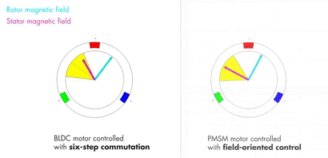
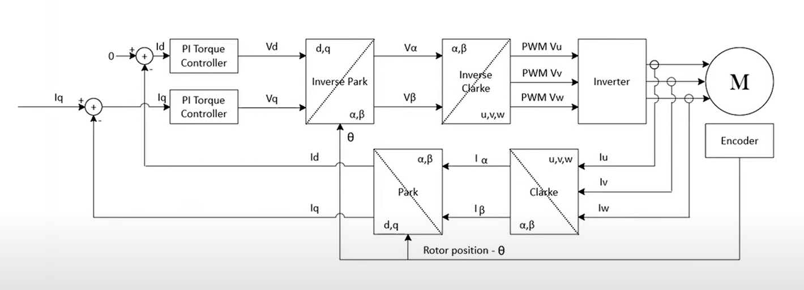

# Field-Oriented Control (FOC) Technical Overview

This document summarizes the key concepts from the Vector Robotics article "FOC Motor Control!!!" and captures the technical details required to understand how field-oriented control works for a 3-phase brushless motor.

## What is Field-Oriented Control?

Field-Oriented Control (FOC) is a method of commutating brushless DC (BLDC) and permanent magnet synchronous motors (PMSM) by controlling the stator currents so that the resulting rotating magnetic field is aligned with the rotor flux.

In FOC, the currents are decomposed into two orthogonal components:

- D-axis current (`i_d`): aligned with the rotor magnetic field, controlling flux.
- Q-axis current (`i_q`): perpendicular to the rotor field, producing torque.

FOC keeps the stator field magnitude constant and rotates it in sync with the rotor angle, usually leading the rotor by a fixed electrical angle. This converts the 3-phase motor into a quasi-DC machine from the controller's perspective.

## Three-phase commutation methods: trapezoidal vs sinusoidal vs FOC

### Trapezoidal commutation

Trapezoidal commutation (also called 6-step or block commutation) applies fixed phase voltages in discrete segments as the rotor moves through electrical sectors.

- Each phase is driven high or low for 120 degrees.
- The current waveform is roughly trapezoidal.
- The back-EMF waveform is also trapezoidal.

This method is simple and common in hobby ESCs, but it produces:

- high torque ripple,
- abrupt current transitions,
- poor low-speed performance,
- audible noise,
- reduced efficiency.

Because the motor current is not continuously aligned with the rotor flux, effective torque varies with rotor position and the control system sees a highly time-varying plant.

The animation below contrasts trapezoidal commutation with field-oriented control, showing the step changes in current and the smoother rotating field produced by FOC.



### Sinusoidal commutation

Sinusoidal commutation drives the motor with three phase currents that follow sinusoidal waveforms separated by 120 electrical degrees.

For a balanced 3-phase system:

```text
i_a = I_peak * sin(omega*t)
i_b = I_peak * sin(omega*t - 2*pi/3)
i_c = I_peak * sin(omega*t + 2*pi/3)
```

Sinusoidal drive produces a smoother rotating magnetic field compared to trapezoidal commutation because the current and back-EMF waveforms are continuous and sinusoidal.

Advantages of sinusoidal commutation:

- Reduced torque ripple compared to trapezoidal control.
- Better low-speed smoothness.
- Lower acoustic noise.

However, a pure sinusoidal system still does not explicitly separate flux and torque control. It simply approximates a rotating vector using sinusoidal phase currents.

The diagram below illustrates the transform and current feedback workflow that underpins both sinusoidal and field-oriented control. In a sinusoidal system, the phase outputs are still generated from a rotating vector representation, but without the explicit D-Q separation of FOC.



### FOC as vector control

FOC is the most advanced form of sinusoidal commutation because it actively transforms measured phase currents into a rotor-aligned reference frame and controls torque and flux separately.

- Trapezoidal commutation = six discrete segments.
- Sinusoidal commutation = fixed sinusoidal currents in stationary phase axes.
- FOC = rotating reference frame control with independent D and Q axes.

The following image compares trapezoidal and field-oriented control visually:


## How FOC works in detail

In FOC, the goal is to make the motor behave as if it is driven by constant voltage/current in a frame that rotates with the rotor.

### Step 1: Measure the motor state

Required measurements:

- Rotor electrical angle `theta_r`.
- Phase currents `i_u`, `i_v`, `i_w` (also called `i_a`, `i_b`, `i_c`).

The rotor angle may come from:

- Hall sensors,
- an encoder,
- a resolver,
- or a sensorless estimator using back-EMF or observer methods.

### Step 2: Clarke transform (abc -> alpha-beta)

The Clarke transform converts three-phase currents into a two-axis stationary coordinate system, sometimes called `alpha-beta` or `X-Y`.

For phase currents `U`, `V`, and `W`:

```text
X = (2*U - V - W) / 3
Y = (V - W) / sqrt(3)
```

A balanced motor satisfies:

```text
U + V + W = 0
```

so the third axis is zero:

```text
Z = (U + V + W) / 3 = 0
```

This transform projects the 3-phase system onto a 2D plane representing the stationary stator field.

### Step 3: Park transform (alpha-beta -> d-q)

The Park transform rotates the stationary current vector into the rotor-aligned D-Q frame using the rotor angle `theta`.

```text
D = cos(theta)*X + sin(theta)*Y
Q = cos(theta)*Y - sin(theta)*X
```

- `D` is the direct-axis current component aligned with the rotor flux.
- `Q` is the quadrature-axis current component perpendicular to the rotor flux.

In the D-Q frame, the torque-producing component is isolated from the flux-producing component.

### Why the D-Q frame is useful

In the rotor-aligned frame, the control references can be constant even though the motor is spinning.

For a purely torque-producing command on a surface-mounted PMSM:

- Set `i_d = 0` (or a small negative value for field weakening).
- Set `i_q = torque_command / K_t`.

The resulting electrical variables no longer depend on `theta` in the same way, so the current controllers see a nearly constant setpoint.

### Torque equation for PMSM

For a surface-mounted permanent magnet motor, electromagnetic torque is approximately:

```text
T_e = (3/2) * p * (psi_f * i_q)
```

where:

- `p` is the number of pole pairs,
- `psi_f` is the permanent magnet flux linkage,
- `i_q` is the quadrature-axis current.

This shows torque is proportional to the Q-axis current.

### Step 4: Current control loops

In a typical FOC implementation there are nested control loops:

1. Inner current loops for `i_d` and `i_q`.
2. Outer velocity and/or position loops.

The inner loops use the D-Q currents measured from the Park transform and compare them to commanded values.

Common controller architecture:

- `i_d` loop: regulate flux.
- `i_q` loop: regulate torque.

These loops usually run faster than the outer velocity/position loops because current dynamics are fast.

### Step 5: Inverse Park and Clarke transforms

Once the current controllers produce desired voltage vectors `V_d` and `V_q`, the inverse transforms convert them back to phase commands.

Inverse Park:

```text
X = cos(theta)*D - sin(theta)*Q
Y = sin(theta)*D + cos(theta)*Q
```

Inverse Clarke:

```text
U = X
V = (-X / 2) + (sqrt(3) / 2) * Y
W = (-X / 2) - (sqrt(3) / 2) * Y
```

The computed phase voltages `U`, `V`, and `W` are then mapped to PWM duty cycles for the inverter stage.

The article figure below illustrates the transform and current feedback workflow between the motor, Clarke/Park transforms, and PWM generation:


## PWM and inverter generation

The desired phase voltages are usually implemented with a three-phase inverter and PWM.

- Sinusoidal PWM or space-vector PWM (SVPWM) are common.
- The generated phase voltages approximate the continuous reference vector.
- The inverter must be synchronized to the rotor angle so the PWM outputs produce the correct spatial field.

### Space-vector modulation (SVPWM)

SVPWM is often used because it maximizes DC bus utilization and produces a better approximation of the reference voltage vector than simple sinusoidal PWM.

SVPWM computes switching times based on the desired `X-Y` or `D-Q` vector and the current sector of the inverter.

## Trapezoidal vs sinusoidal vs FOC: technical comparison

| Feature | Trapezoidal | Sinusoidal | FOC |
|---|---|---|---|
| Current waveform | Step-like / block | Smooth sinusoid | Smooth, vector-aligned |
| Torque ripple | High | Moderate | Very low |
| Low-speed control | Poor | Better | Best |
| Complexity | Low | Medium | High |
| Sensorless support | Common | Possible | Common but more complex |
| Efficiency | Lower | Higher | Highest |

### Why trapezoidal torque ripple occurs

In trapezoidal commutation, the current is not aligned to the instantaneous rotor flux angle. Therefore torque varies with electrical angle as the back-EMF and current overlap changes. This creates the familiar "cogging" or "lumpiness" in motion.

### Why sinusoidal is better

Sinusoidal commutation reduces torque ripple by making the phase currents smoother, but it still does not explicitly decouple flux and torque. It is effectively a better approximation of a rotating vector field.

### Why FOC is best

FOC explicitly aligns the current vector with the rotor flux vector in the rotating frame and independently controls flux and torque. This separation is the key technical advantage.

## Sensorless FOC and rotor position estimation

Sensorless FOC infers rotor position from motor electrical measurements rather than a physical encoder.

Common methods:

- Back-EMF observation.
- Sliding-mode observers.
- Extended Kalman filters.
- Model reference adaptive systems.

The article notes that sensorless FOC is possible, but complicated. For many applications, a direct position sensor simplifies implementation.

## Field weakening and flux control

For voltage-limited systems, high-speed operation can require field weakening.

- `i_d` is driven negative to reduce the net flux.
- This reduces back-EMF and allows higher speed at the cost of reduced torque.

Field weakening is an advanced FOC feature that requires careful control of the `i_d` loop.

## Practical implementation notes

- Use a precise rotor angle measurement or estimator.
- Sample phase currents with differential ADCs or current shunts.
- Compute `sin(theta)` and `cos(theta)` efficiently with CORDIC, lookup tables, or fast approximations.
- Run the current loops at a high frequency, typically several kHz or more.
- Use a robust PI/PI controller design and tune gains separately for `i_d` and `i_q`.
- If using a three-shunt measurement, derive the third phase current from the zero-sum property or measure all three for redundancy.

The Vector Robotics implementation is currently in constant torque mode, which means the `i_q` target is held constant and speed changes with load. A full velocity or position controller would add another layer on top of the torque loop.

## Figures from the article

The images downloaded from the article are saved under `doc/foc_images/`:

- `FOC-torque-control-loop-1.png`: diagram illustrating transform and current feedback workflow for FOC.
- `Understanding_Field_Oriented_Control_Brushless_Motor_Control_with_Simulink_Part_4-1.gif`: animation comparing trapezoidal and field-oriented control.

## Summary

Field-Oriented Control uses the Clarke and Park transforms to convert phase currents into a rotor-aligned D-Q frame. In that frame, `i_d` controls flux and `i_q` controls torque. The controller keeps the D-Q targets constant while the rotor spins, then transforms the results back to 3-phase commands using inverse Park and Clarke transforms. Compared to trapezoidal or sinusoidal commutation, FOC yields the smoothest torque, best low-speed behavior, and highest efficiency.
